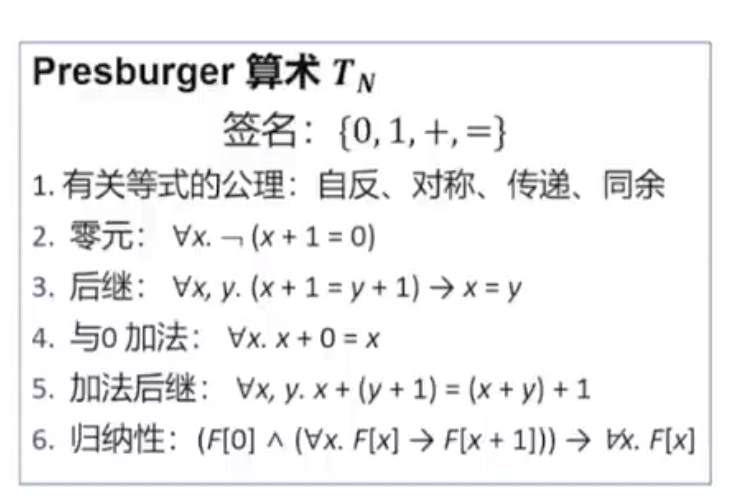

# 一阶理论

**命题逻辑propositional logic**的<u>表达能力有限</u>, 在比较复杂的情况下表达能力不足, **描述能力**远不如**谓词逻辑**（一阶逻辑）。那么，我们可以将可满足性问题**扩展**到一阶逻辑上。

一**阶逻辑first order logic**有较强的表达能力, 但<u>一阶逻辑是不可判定/半可判定的</u>. 然而，有时候我们不需要这么强的表达能力, 因为这样的**扩展过于宽泛**，以至于**难以提出有效的算法来对该问题进行求解**。于是，我们需要将可满足性问题研究的对象再适当**收缩**一下。例如，<u>将讨论的谓词逻辑公式**限制**在某一（或者**某些**）**理论Theories**下。</u>

所以有时候会**针对应用, 对非逻辑符号的使用进行限制**, 进而获得兼具表达能力和可判定性的逻辑理论, 此即为**一阶理论**.  

**<u>Theory即是对非逻辑符号的使用限制.</u>**

## **一阶理论**是**一阶逻辑的受限形式**. 

* **signature**: 理论中允许出现的非逻辑符号集合. 包含**constant**, **variable**, **functions** and **predicates**.
* **axiom**: 规定这些非逻辑符号的含义.

e.g.

## signature和term的区别

* term为一阶逻辑的概念, 定义了 predicate的参数: $Predicate(term_1, term_2,...term_n)$

  term包含:常量c, 变量x, 以及由他们构成的函数

* signature为一阶理论(一阶逻辑的受限形式)的概念, 定义了所有能出现的**非逻辑符号**.

  signature包含: constant, variable, function 和 predicate.

  

## 逻辑符号

一阶逻辑中使用的逻辑符号如下:

1. **Logical Connectives**:
   * **Negation**: ¬ (not)
   * **Conjunction**: ∧ (and)
   * **Disjunction**: ∨ (or)
   * **Implication**: → (implies)
   * **Biconditional**: ↔ (if and only if)
2. **Quantifiers**:
   * **Universal Quantifier**: ∀ (for all, for every)
   * **Existential Quantifier**: ∃ (there exists)
3. **Equality**:
   * **Equality**: = (equal)
4. **Parentheses**: (, ) - Used for grouping and precedence of operations.