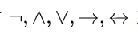
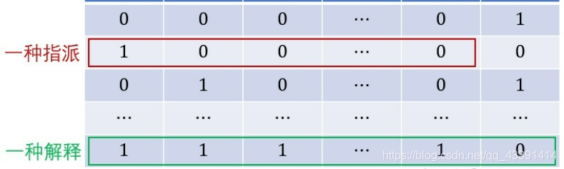
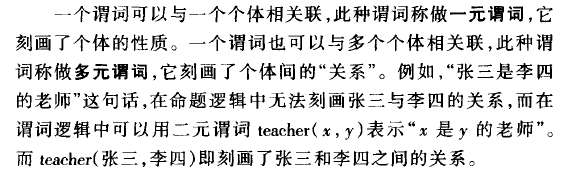

# 命题逻辑、一阶逻辑和二阶逻辑

本文介绍**命题逻辑**<u>(很少部分人叫它作**零阶逻辑**)</u>. 、一阶逻辑和二阶逻辑。这些形式推理的逻辑系统表达与推理能力依次增强。

## 命题 proposition

命题有真假，所以能称得上是命题的句子有一定的特点，比如不是一个问句，<u>肯定是一个陈述句</u>，进一步，即使是陈述句，也未必是命题。即**命题是具有真假值的陈述句**。一般，我们去判断一个陈述句是不是命题，只要想想这个陈述句是不是有判断的意味即可。比如"5<2"是一个命题，而且是一个假命题。再如“我比我爸爸年纪小"是命题，而且是一个真命题。

但是，有的时候判断一个命题是难的，比如著名的“说谎者悖论”，"我在说谎“是命题吗？答案：这个是悖论，不是命题。**悖论是指同一命题中有<u>两个对立结论</u>，而两个结论<u>都能自圆其说</u>**。即：事件P可以推导出事件非P；事件非P可以推导出事件P

"我现在说的这句话是谎话"

如果是真的，则"我现在说的这句话是谎话"本身就是一个慌，与真的矛盾。
如果是假的。则"我现在说的这句话是谎话"则是一个谎言, 应该为真，与假的又矛盾。

***

## 命题逻辑 propositional logic

我们确定一个命题之后，为了形式化，将这些命题都用小写字母p , q , r表示。然后我们使用命题连接词，将上述p , q , r组合成更加复杂的命题，称为**命题公式 propositional formulae**，此时p , q , r则称为命题变元或者**原子命题 atomic proposition**（即不可再分）。我们也可以把这一过程形式化为$\alpha=f(p,q,r)$

命题连接词：常用的有如下五个，非，且（合取），或（析取），蕴含（推出），等价（当且仅当）

e.g.
设$\alpha=f(p,q,r)=p \wedge q \wedge r$, 则若$(p,q,r)=(1,1,0)$，则命题公式$\alpha$为假.

对于一个 propositional formulae, 可以构建一个真值表. 对于$\alpha=p \wedge q $ :

| p    | q    | α    |
| ---- | ---- | ---- |
| 0    | 0    | 0    |
| 0    | 1    | 0    |
| 1    | 0    | 0    |
| 1    | 1    | 1    |

**指派(assignment)**和**解释(interpretation)**的概念：设$\alpha=f(p_1,\cdots,p_n)$，其可以绘制其真值表，（最后一列是formulae此时的真值, 即因变量$\alpha$的值）。

> 指派assignment给每个P分配一个值。给所有的P分配值后，此时这些值的组合方式和α此时的值，共同呈现出一种展现方式，即为这个公式的一种解释interpretation。即, interpretation=assignment+α

***

## 一阶逻辑 first order logic

作为命题逻辑向一阶逻辑的过渡, 请看如下三段式:

>所有人都会死
>苏格拉底是人
>所以苏格拉底会死

这个逻辑关系能否用命题逻辑表达？我们先定义：

> p:所有人都会死
> q:苏格拉底是人
> r:苏格拉底会死

似乎看起来不错，为了表达原文中的因果关系，有: $(p\wedge q) \rightarrow r$. 这个逻辑表达式似乎也还行，但是只把原文的表层意思表达了出来。

如果用上述来表达原文的话，那么考虑如下例子:记命题变元s为

> s:小明是人
> t:小明会死

你能够得到什么结论？从原文的话，我们可以得出 t :小明会死的结论，但是如果你忘记原文，只从用命题逻辑的角度推理，完全无法根据$(p\wedge q) ->r$ 和 s 推出 t.

现在我们考虑使用**一阶逻辑**（First-order Logic）。其也是一种形式符号推理系统，也叫**一阶谓词演算**、**低阶谓词演算**(Predicate Calculus）、**限量词**（Quantifier）**理论**，也有人称其为“谓词逻辑”，虽然这种说法不够精确。总之，不管怎么说，一阶逻辑就是一种形式推理的逻辑系统，是一种抽象推理的符号工具。一阶逻辑的特点为:

* 一阶逻辑不同于单纯的“命题逻辑”，因为，一阶逻辑里面使用了**任意∃**和**存在∀**。举一个一阶逻辑表达式的例子：

  > ∃x(Math(x) → Prof(x)）

  其表示：存在一个x，如果x是数学老师，那么x是教授。
  
  再举一个例子如下：

  > ∀x(Math(x) → Prof(x)）

  其表示：任意一个x，如果x是数学老师，那么x是教授。

* 从上面两个例子中, 可以发现一阶逻辑的另一特点：命题逻辑中<u>命题的一些**名词**</u>被**变量化**了。为了以示区别，再举例如下:

  命题逻辑中的表示：

  > 小明是一位数学家
  > p:小明是一位数学家

  一阶逻辑中的表示：

  > 小明是一位数学家
  > **math(小明)**。其中math(x)表示：x是一位数学家。

  **名词**小明在上述例子中被**变量化**. 

此时,可以将前面的三段论使用一阶逻辑进行完美的表示: 

> 所有人都会死
> 苏格拉底是人
> 所以苏格拉底会死
> 定义：
> die(x)：x会死
> people(x):x是人
> 那么上述三段论可以表示为：
>
> ∀ x (people(x)-> die(x))
> people(“苏格拉底”)->die(“苏格拉底”)

这一次，如果小明是人，那么有people(“小明”)，我们根据$\forall$ x ($people(x) \rightarrow die(x)$)，可以推导出die(“小明”)，即小明会死。这次总算完美解决了.

### 相关概念

**谓词 predicate**：一个含有变量的命题，例如上述math(x)。

**谓词符号 predicate symbol**：就是上述的math,die之类的。只是通常我们习惯用大写表示比如：F,G,H，但是随便用也行。

**函数符号 function symbol**：这个我们早已熟悉。通常用小写表示f,g,h，但是随便也行，比如我们构造函数的时候，使用的F。

*谓词符号*和*函数符号*非常相似，只是在映射上，函数更加宽泛f : A − > B，而谓词更加狭窄F : D − > E = { 0 , 1 }, 比如people("桌子”）是假的，所以为0.

**个体域 domain**：即谓词中变量的取值范围。比如math(x)，x的取值范围是人这种类型的个体。
个体域可是有限的，也可以是无限的。

#### 二阶逻辑

有了一阶逻辑的概念之后，二阶逻辑水到渠成。假设你要将如下语句翻译成逻辑：

> Leibniz Law: “对于任意individual x和y, 如果x和y相等, 那么**对于任意性质P**, P(x)当且仅当P(y).”

那么显然，翻译如下：

> P(z):z具有性质P。
> E(u,v):u和v相等。
> 那么从而翻译为：
> ∀x,y[E(x,y)→**∀P**(P(x)↔P(y)]

例子中量词符号<u>作用在**谓词符号**</u>上$\forall P$, 而在一阶谓词中只允许量词作用在个体上，例如$\forall x \quad P(x)$。这就是一阶逻辑和二阶逻辑的区别。

Reference:

https://liubingqing.blog.csdn.net/article/details/117397388?spm=1001.2101.3001.6650.1&utm_medium=distribute.pc_relevant.none-task-blog-2%7Edefault%7ECTRLIST%7ERate-1-117397388-blog-89473681.235%5Ev38%5Epc_relevant_anti_t3&depth_1-utm_source=distribute.pc_relevant.none-task-blog-2%7Edefault%7ECTRLIST%7ERate-1-117397388-blog-89473681.235%5Ev38%5Epc_relevant_anti_t3&utm_relevant_index=2

https://blog.csdn.net/pilifeng1/article/details/85036619?spm=1001.2101.3001.6650.4&utm_medium=distribute.pc_relevant.none-task-blog-2%7Edefault%7ECTRLIST%7ERate-4-85036619-blog-89473681.235%5Ev38%5Epc_relevant_anti_t3&depth_1-utm_source=distribute.pc_relevant.none-task-blog-2%7Edefault%7ECTRLIST%7ERate-4-85036619-blog-89473681.235%5Ev38%5Epc_relevant_anti_t3&utm_relevant_index=9
