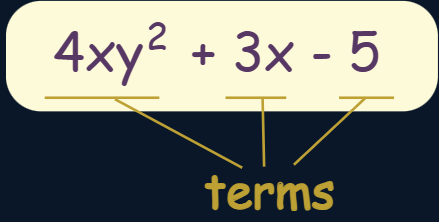
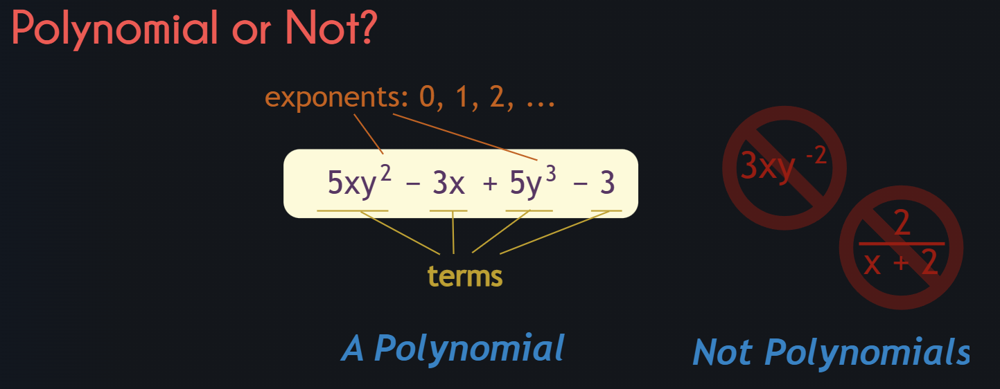
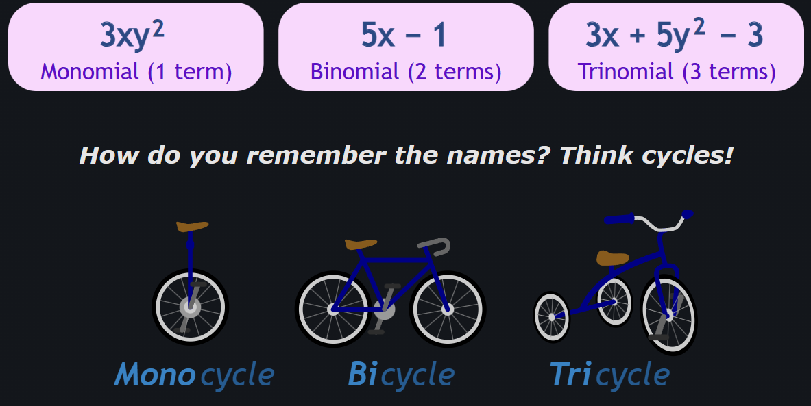
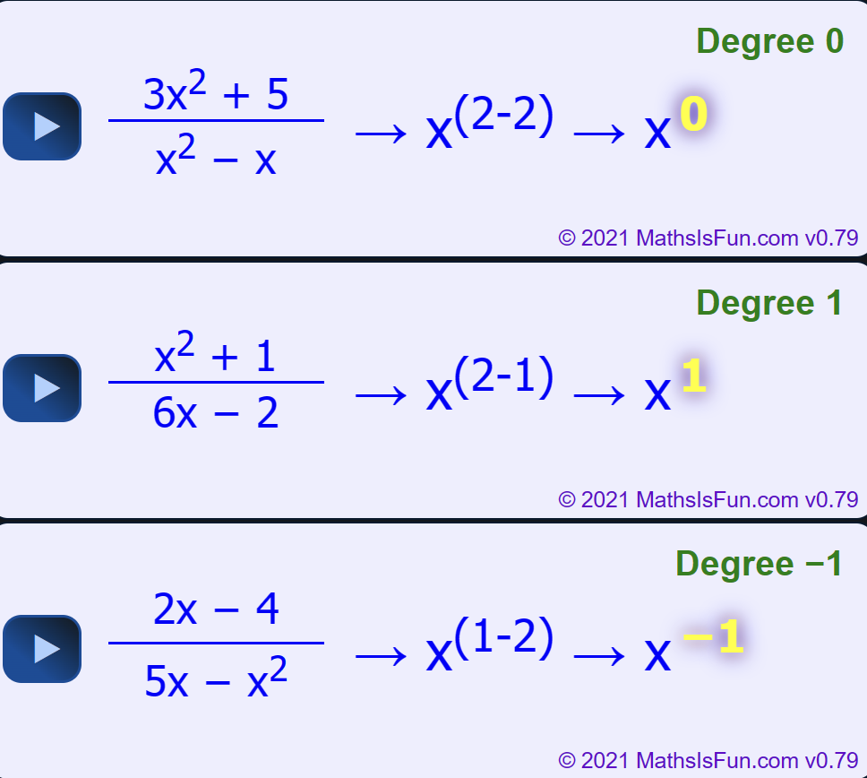

# polynomial

A polynomial looks like this:

*  *`poly-`* (meaning "**many**")
* *`-nomial`* (in this case meaning "**term**") 
* so `polynomials` says "**many terms**"

A polynomial can have:

| **[constants](https://www.mathsisfun.com/algebra/definitions.html)** (like **3**, **−20**, or $½$) |
| ------------------------------------------------------------ |
| **[variables](https://www.mathsisfun.com/algebra/definitions.html)** (like ***x*** and ***y***) |
| **[exponents](https://www.mathsisfun.com/exponent.html)** (like the 2 in $y^2$), but only **0, 1, 2, 3, ...** etc. are allowed |

### Monomial, Binomial, Trinomial

There are special names for polynomials with 1, 2 or 3 terms:

### Variables

* Polynomials can have **no variable** at all

Example: 21 is a polynomial. It has just one term, which is a constant.

* Or **one variable**

Example: x4 − 2x2 + x  has three terms, but only one variable (x)

* Or **two or more variables**

Example: xy4 − 5x2z  has two terms, and three variables (x, y and z)

### Degree

The **degree** of a polynomial with only one variable is the **largest exponent** of that variable.

### Example:

| 4x3 − x + 2 | The Degree is **3** (the largest exponent of ***x\***) |
| ----------- | ------------------------------------------------------ |
|             |                                                        |

For more complicated cases, read [Degree (of an Expression)](https://www.mathsisfun.com/algebra/degree-expression.html).

### degree of a polynomial with more than one variable

对term中各个变量的幂指数求和.

* **5xy2** has a degree of **3** (x has an exponent of 1, y has 2, and 1+2=3)
* **3x** has a degree of **1** (x has an exponent of 1)
* **5y3** has a degree of **3** (y has an exponent of 3)
* **3** has a degree of 0 (no variable)

### degree of expression which is a fraction

用分子的degree**减去**分母的degree

### Standard Form

The [Standard Form](https://www.mathsisfun.com/algebra/standard-form.html) for writing a polynomial is to put the terms with the highest degree first.

### Example: Put this in Standard Form: $3x^2 − 7 + 4x^3 + x^6$

The highest degree is 6, so that goes first, then 3, 2 and then the constant last:

$x^6 + 4x^3 + 3x^2 − 7$

You **don't have to** use Standard Form, but it helps.

## quantifier-free nonlinear real arithmetic (QFNRA)

$$
\begin{align}
p &:= const \big| x \big| (p + p) \big| (p - p) \big| (p \times p)\quad \text{polynomials}\\
c &:= p < 0 \big| p = 0 \qquad (polynomial) constraints\\
\phi &:= c \big| \phi \and \phi \big|\neg \phi \qquad QFNRA formulas
\end{align}
$$

