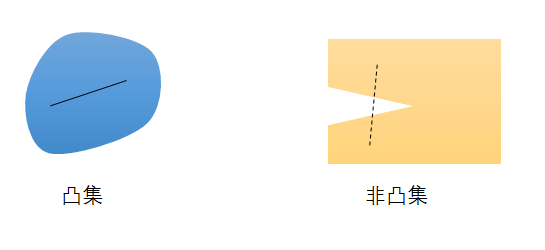
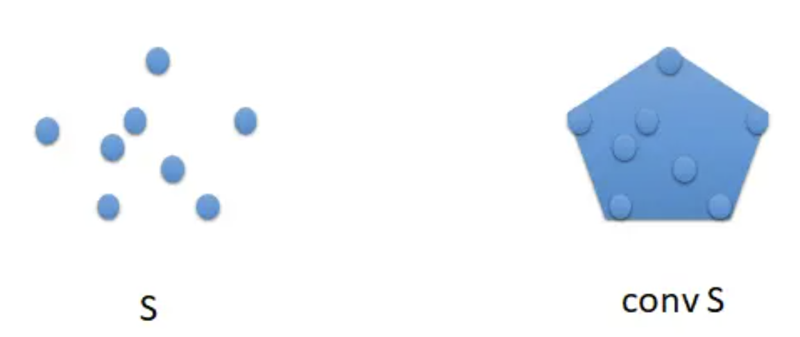
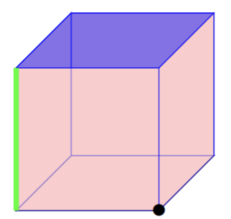

# 凸包（Convex Hull）

凸包（Convex Hull）是一个计算几何（图形学）中的概念。

## 凸包 Convex Hull 和凸集 Convex Set

### 凸集

如果任取一个集合 C 中的2点 $x_{1},x_{2}$ ，有 $conv\{x_{1},x_{2}\}$ 都在 C 中，就说 C 是个**凸集(convex set)**。换句话说，任取 C 中的2点，则过它们的线段上的每个点也在 C 中，那么 C 就是凸集，凸集中任意两点能够看得见彼此。上图左边的是凸集，右边的不是凸集，有一部分“凹”进去了。

即在欧氏空间中，凸集是对于集合内的**每一对点**，**连接**该对点的**直线段**上的**每个点**也在该集合内。

### 凸包

S 中任意点的凸组合构成的集合叫做 S 的**凸包 (convex hull)，**记为 $conv\ S=\{\theta_{1}x_{1}+...+\theta_{k}x_{k}: x_{1}..x_{k}\in S,\theta_{1}..\theta_{k}\geq 0,\theta_{1}+...+\theta_{k}=1\}$ 。你可以这样想象集合 S 的凸包，你用一个扎头发的橡皮筋套住 S ，橡皮筋自然收缩后圈住的部分就是 S 的凸包。

设**S**为欧几里得空间 的**任意子集**。包含S的**最小凸集**称为S的**凸包**，记作conv(S)。

**凸集（仿射集）的交集仍为凸集（仿射集）**。**凸包是所有包含 S 的凸集的交，是包含 S 的最小的凸集。**

***

## 凸包的面 face of Polytope

想象一下将一个立方体扔到平坦的表面上。立方体接触地面的点形成立方体的一个面face。最有可能的是，立方体会落在其 6 个正方形上，因此这些squares 正方形是立方体的面face。立方体的 12 条边edges不太可能掉落，但这些边也是立方体的面face。最不可能的是，立方体可能掉落到其一个角corner上，但是这些角也是立方体的面face。

More generally，对于任何多面体, faces can be thought of as the **sets of points** that can
**rest on a flat surface**。例如，立方体的任何对边都不会形成一个面，因为立方体的顶部和底部不可能同时放置在同一表面上。

凸多胞形的面是多胞形与半空间的任意交集，使得多胞形的内点都不位于半空间的边界上。A **face** of a convex polytope is any intersection of the polytope with a **halfspace** such that none of the interior points of the polytope lie on the boundary of the halfspace. 同样，面是在多胞形的某些有效不等式中给出相等性的点的集合。Equivalently, a face is the set of points giving equality in some valid inequality of the polytope.

If a polytope is *d*-dimensional, 

* its [facets](https://en.wikipedia.org/wiki/Facet_(mathematics)) are its (*d* − 1)-dimensional faces

  **维面**（**Facet**）又称为**超面**（**hyperface**[[1\]](https://zh.wikipedia.org/wiki/維面#cite_note-1)）是指[几何形状](https://zh.wikipedia.org/wiki/几何形状)的组成元素中，比该几何形状所在维度少一个维度的元素.

* its [vertices](https://en.wikipedia.org/wiki/Vertex_(geometry)) are its 0-dimensional faces

* its [edges](https://en.wikipedia.org/wiki/Edge_(geometry)) are its 1-dimensional faces

* its [ridges](https://en.wikipedia.org/wiki/Ridge_(geometry)) are its (*d* − 2)-dimensional faces. 

  A ridge is seen as the boundary between exactly two facets of a polytope. ridge 可以看成两个维面的边界.