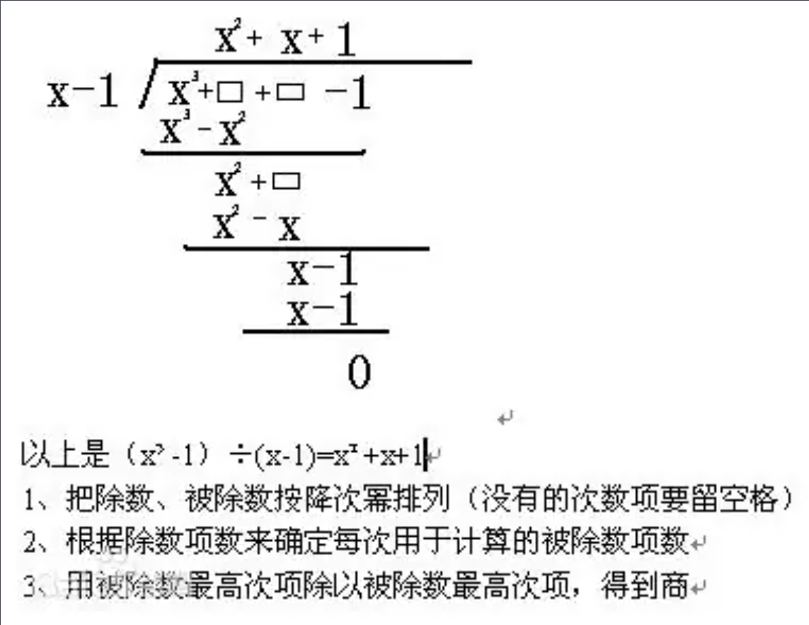

# polynomial division 多项式除法

把被除式、除式按某个字母作降幂排列，并把所缺的项用零补齐，写成如图中所示形式, 然后商和余数可以这样计算：

1. 将排序后被除数的第一项(即幂次数最高的项)除以除数的第一项(即幂次数最高的项，此处为*x*）。结果写在横线之上($x^3 ÷ x = x^2$).
2. 将除数乘以刚得到结果（最终商的第一项），乘积写在分子前两项之下（同类项对齐） ($x^2·(x−1) = x^3−x^2$).
3. 从分子的相应项中减去刚得到的乘积（消去相等项，把不相等的项结合起来），结果写在下面。($x^3−(x^3−x^2) =x^2$)然后，将被除数的下一项“拿下来”。
4. 把减得的差当作新的被除式，重复前三步（直到余式为**零**或余式的**次数低于除式的次数**时为止．被除式=除式×商式+余式 ）
5. 重复第四步。这次没什么可以“拿下来”了。

横线之上的多项式即为商，而剩下的 (这个例子中没有) 就是**余数**。