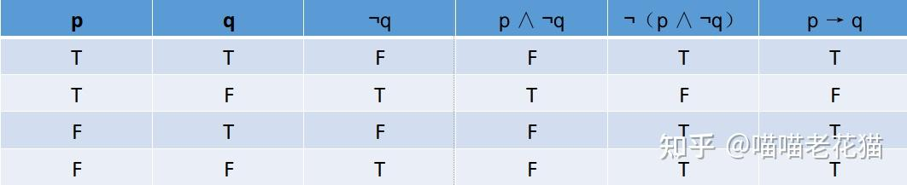

# material implication

## 实质蕴含 (material implication)

对任一条件陈述“如果p那么q”来说, 如果已知合取**p ∧ ¬q**为真, 也就是说，如果它的**前件为真**且**后件为假**, 则可知该条件**陈述为假**.

若一个条件**陈述为真**, 则上面所示**合取式**必定为假, 即它的**否定** **¬（p ∧ ¬q）**必定为**真**.

据此，我们可把**¬（p ∧ ¬q）**当做“**如果p那么q**”的含义的一部分, 也就是说：**¬（p ∧ ¬q）相当于 p → q**

这种关系可以用如下真值表表示:

根据实质蕴涵的定义及其真值表, 一个实质蕴涵命题只有在**前件真后件假**时才是**假的**. **在其余情况下，它都是真的. **

***

## 定理

从实质蕴涵的真值表, 可以导出一系列与思维直觉相悖的定理

其中最主要的有：

1．q→（p→q）

q为真, 则p→q必定为真

2．¬p→（p→q）

p为假, 则p→q必定为真

3．（p→q）V（q→p）

即“任何两命题之间必有蕴涵关系”

***

## 严格蕴含 (strict implication)

在命题逻辑中，我们将“如果P那么Q”符号表示为“P→Q”，“P→Q”叫做“实质蕴涵”。**实质蕴涵**的逻辑性质完全**由“→”的特征真值表决定**。一个明显的事实是，“→"与日常语言的“如果……那么……的含义并不完全相同，有时相去甚远。

>e.g.
>
>(1)李白是诗人 → 2+2=4
>
>是一个真命题，既然它的前件和后件都是真的。但是
>
>（2）如果李白是诗人，那么2+2=4
>
>在日常语言中则是一个假命题甚至是无意义的。

这是因为日常语言中的蕴涵命题的真值不仅取决于前件和后件的真值，而且取决于前件和后件之间的关系。具体地说，仅当**前件和后件之间具有某种必然联系**时，**日常语言**中的**蕴涵命题才为真**。命题（2）之所以常常被人们看作假的，就是因为它的前件和后件之间没有必然联系。为了更好地反映日常语言的蕴涵命题, 模态命题逻辑提出一种不同于实质蕴涵的蕴涵关系，即**严格蕴涵(strict implication)**，其定义是：

**P严格蕴涵Q, 当且仅当， P→Q是必然的**。

从这个定义我们可以看出，严格蕴含比实质蕴涵命题断定得更多更强。

因此，如果一个命题作为**严格蕴涵命题是真的**，那么，该命题作为**实质蕴涵命题也是真的**；

换言之，如果一个命题作为**实质蕴涵命题是假的**，那么，该命题作为**严格蕴涵命题也是假的**。

此论断的逆论断不成立。

> e.g.
>
> （3）如果3被2整除，那么9被2整除。
>
> （4）如果美国有核武器，那么美国立即发动第三次世界大战。
>
> 分析：
>
> （3）作为严格蕴涵命题是真的，因为它的前件和后件之间的蕴涵关系具有必然性；
>
> （3）作为实质蕴湎命题也是真的，既然它的前件是假的。
>
> （4）作为实质蕴涵命题是假的，因为（4）的前件真而后件假；
>
> 同时， （4）的前件真而后件假这一事实足以表明（4）的前件和后件之间没有必然联系，
>
> 因而（4）作为严格蕴涵命题也是假的。