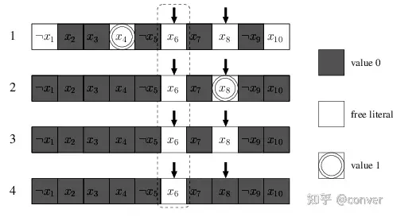

># 2-literal watching

**布尔约束传播**（**Boolean Constraint Propagation**，简称 **BCP**）。算法会用 BCP 来给这些因为单位子句而逻辑上只剩一种可能的变量赋值。有时，把 BCP 用在一个子句上会使得别的子句也变成单位子句。算法会**重复**执行 BCP，直到没有新的单位子句。

SAT求解器的80～90时间都用来执行BCP过程，所以**BCP的执行效率很重要**。近几年发明了很多算法来加速蕴含推导（implication）的过程，目的是**更快的判断一个赋值（assignment）**<u>是否导致有子句（clause）变成了**单位子句（unit）**</u>**或者**<u>发生了**冲突（conflict）**</u>

SAT solver chaff[[2\]](https://zhuanlan.zhihu.com/p/465917163#ref_2) 提出了双字面量监督算法（2-literal watching）来加速BCP过程。它基于zhang和stickel提出的使用首尾head/tail list的方法，它不如2-literal watching，因为它回溯后需要花时间找新的监督变量。

***

## BCP 检查过程

对每一次赋值，BCP需要检查每一个子句，看以下三种情况是否发生：

1. 子句中<u>所有的字面量（literal）都为假</u>，即**冲突子句**：我们已经检测到当前赋值不合适，需要**回溯**
2. <u>除了一个字面量其它都为假</u>，即**单位子句**：算法需要推测此字面量为真，进行**布尔约束传播**（BCP）
3. 子句有**至少两个自由字面量**，或者已经**有字面量值为真**：<u>这样的子句没法帮助做进一步推理</u>，除非继续赋值或发生回溯。

### BCP**检查方法一**:

为了进行上述检查，一个简单的方法是每个子句**记录一个counter**，conter中记录了这个子句中**真和假的literal数量**。当一个变量**被赋值**，<u>包含这个变量的子句</u>需要**更新他们的conter**，然后根据conter的值判断是否发生蕴含推导或者冲突。这个传播算法的复杂度是随着问题的数据量改变的。
它的**缺点**是不管什么时候**只要有变量被赋值，含有这个变量的子句就要被更新**，当取消赋值的时候同样。给出一个布尔公式，其含有m个子句，n个变量，每个子句含l个字面量。平均<u>每个变量出现`lm/n`次</u>。在BCP过程中，<u>每次赋值发生后，平均有`lm/n`个个counter要被更新，每次取消赋值同理</u>。

### BCP**检查方法二**:

为了使传播效率更高，chaff提出了**双字面量监督（2-literal watching）的BCP算法**. 首先有这样一个性质：**一个子句只要有<u>两个不同的字面量还不为0</u>他就不会成为单位子句或冲突。**所以我们只要**监视两个非零字面量**就好了。这两个字面量被称为**watched literals**。他们可以在子句中的任何位置，他们被初始化为一个子句中任意一对位置不同的自由字面量。

每一个变量x有两个list列表: 

1. **pos_watched(x)**中存放着被监视的**x的位置(即x以x作为literal出现的clause位置)**，**当x被赋值为0**时<u>会被考虑</u>。
2. **neg_watched(x)**中存放着被监视**¬x的位置(即x以¬x作为literal出现的clause位置)**，**当x被赋值为1**时<u>会被考虑</u>。

**当发生赋值的时候**，我们**检查对应的列表中的每一个位置p(当x被赋值为0时考虑pos_watched(x), 当x被赋值为1时考虑neg_watched(x),即检查会被赋值为0的literal)，在p所在的子句中寻找一个新的非零字面量**。可能会发生以下情况：

1. **找到**一个与被观察的两个字面量不同的**非零字面量y**。然后将位置p从x的literal watching中删除，加入y的literal watching(从pos/neg_watched(x)中删掉p, 在**pos/neg_watched(y)中加入p**)。这是唯一watching literal会被改动的情况。
2. **唯一的非零变量y是另一个watched literal**。如果**y的值是1**，那么**什么都不需要做**.
3. **唯一的非零变量y是另一个watched literal**。如果**y是自由字面量**，则**这个子句是单位子句**, 我们提醒求解器赋值, **y将被赋值为1**。
4. **所有字面量的值都为0**，不存在y，这个子句为**冲突子句(conflict)**。

e.g.

图中被监视的字面量为X6和X8，x6被赋值为0，可能会出现上述四种情况。

Pros:

1. 这样每次赋值，被监督的字面量个数为2m/n个，因为只有相反赋值需要被监督，实际上平均只有m/n个。
2. 每一次回溯发生，我们只要在常数时间就能调整好watching框架。因为case1中回溯后我们的两个监督位置依然有效；case2-4中，我们的当前假设是这个watched literal为0，但是回溯后它又会变为自由变量（非零变量），再次有效。