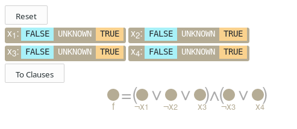
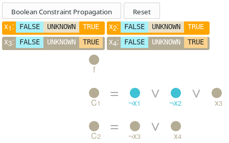
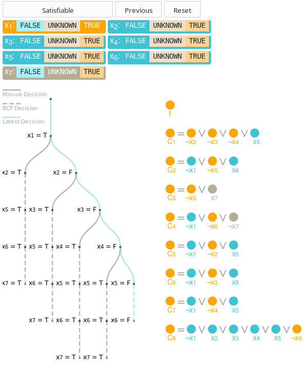
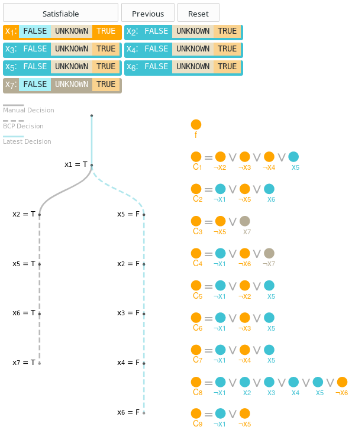
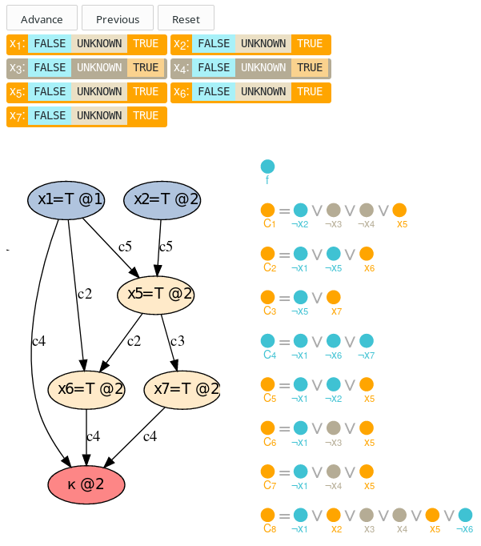
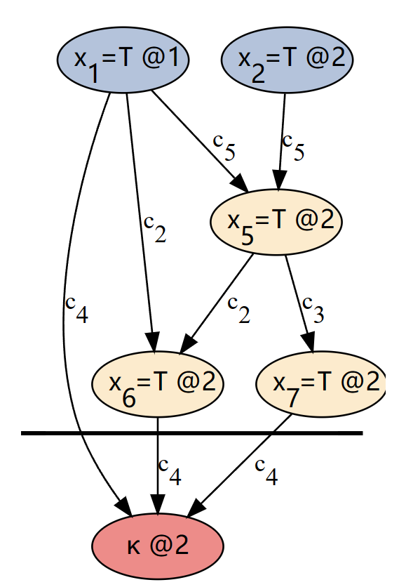
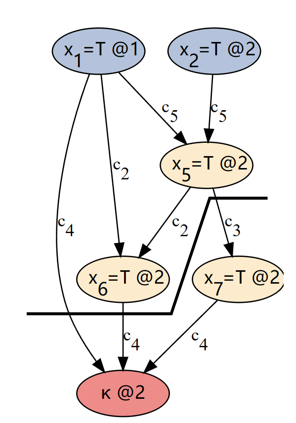
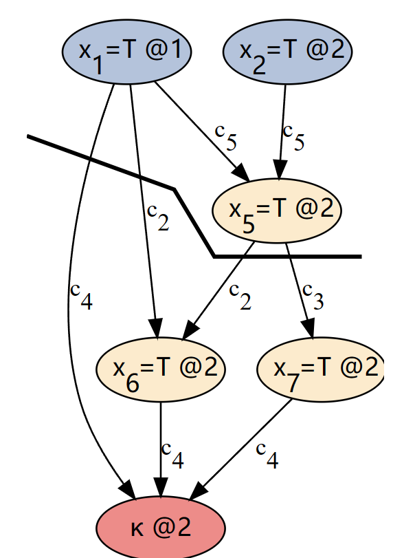

# DPLL&CDCL

## Boolean Satisfiability Problem布尔可满足性问题

**布尔可满足性问题**`Boolean Satisfiability Problem`是这样的问题：给定一个布尔公式，我们要判断是否能给公式中的布尔变量赋予一些值，使得公式算出来为真。

如果一个布尔公式能通过赋值，使得其为真，那么它就是**可满足**的（**satisfiable**）；如果这样的赋值不存在，它就是**不可满足**（**unsatisfiable**）的。

一般来说，求解一个布尔可满足性问题需要很长时间（事实上，它是NP-Complete的）。如果一个布尔公式有 n 个变量，那么就总共有 2^n 种可能的赋值。所有已知的算法，在最坏的情况下，都要把这个指数大小的搜索空间全部搜一遍。不过，现实中的问题通常有一些**可以利用的逻辑结构**，让算法能更好的搜索。

***

## DPLL&CDCL

接下来会介绍两种SAT算法: **Davis-Putnam-Logemann-Loveland 算法**（简称 **DPLL**），它是现代的 SAT 求解算法的根基。第二种是**冲突驱动子句学习算法**（**Conflict-Driven Clause Learning Algorithm**，简称 **CDCL**），它出现于 1996 年前后，对第一种算法进行了非常巧妙的改进。

两种算法都只能用于写成**合取范式**（Conjunctive Normal Form，简称 **CNF**）的公式。写成合取范式的公式由一些**子句**（clause）**与**（AND， ∧ ）而成；子句则是由**字面量**（literal）**或**（OR， ∨ ）而成；<u>每个字面量就是一个变量，或者由变量取**非**（ ¬ ）得到.</u>

合取范式有一些很好的性质，让推理更加方便。由于这样的公式只是一些子句“与”起来，**为使公式满足**，**每个子句clause也都必须得到满足**；由于每个子句只是一些字面量“或”起来，**只要满足了一个字面量literal就满足了整个子句clause**。

以下是一个合取范式的例子:

（请到原文[^原文]处查看。）

在这里，我们把合取范式写成了一行。如果公式很长的话，这样写就会显得很笨重。以后我们会把它写成每行一个子句的形式。点击例子中的“To Clauses”和“To Formula”两个按钮可以查看这两种表示法的区别。只要记住所有的子句都为真时整个公式才为真这一点就行了。

***

## Boolean Constraints Propagation布尔约束传播BCP

一种对赋值搜索算法的优化方法是利用**单位子句(unit clauses)**。如果一个子句中，<u>除了一个未决定的字面量，所有字面量都已经确定为假</u>，我们就称这个子句为**unit clause**. 

当CNF的众多clause中<u>出现unit clause</u>时, 即可进行BCP. 即<u>unit clause所剩下的literal必须为真</u>, 同时此<u>赋值也将影响到其他clause</u>, 可能<u>会形成更多的unit clause</u>. 此步骤将大大加速satisfiability的判断速度.  

在下面的例子中，我们已经猜测X1 和 X2 为真。试试预测一下 BCP 会如何运作：

（原文这里又是一个可互动的例子。请到原文[^原文]处查看。）

***

## Davis-Putnam-Logemann-Loveland 算法DPLL

[DPLL](https://link.zhihu.com/?target=https%3A//en.wikipedia.org/wiki/DPLL_algorithm) 算法是一种基于递归回溯（[backtracking](https://link.zhihu.com/?target=https%3A//en.wikipedia.org/wiki/Backtracking)），**利用 BCP** 的 **SAT 求解算法**。一个朴素的回溯算法会检查所有可能的赋值，直到找到一个解；而 DPLL 算法 则会**利用 BCP 来删掉一些不可能满足公式的赋值**，缩小搜索树。当遇到冲突时，它会回溯到上一个并非由 BCP 作出的决定，选择另一种可能的值。

在下面的例子中你可以看到 DPLL 是如何工作的。左边我们显示了**决策树**（decision tree），它显示了算法的搜索记录。边代表算法的猜测或决策，虚线边代表使用BCP做出的决策。蓝色的路径表示当前所在的路径。

> 图中**实线为manual decision**, **虚线则为BCP对变量的赋值**. 若BCP无法使CNF为真, 则退回并修改manual decision的决策(若之前赋值为真则反之赋值为假).

(原文这里又是一个可互动的例子，而且是非常重要的例子，把 DPLL 算法从头到尾走了一遍。请到原文[^原文]处查看。）

***

## Conflict-driven clause learning冲突驱动子句学习

DPLL 有三个缺点。首先，它的**决策是朴素**（naive）**的**。其次，它遇到冲突的时候，只知道当前的部分赋值会导致冲突，除此之外**学不到任何东西**。第三，它**每次只会回溯一层**，因此会把大量时间浪费在一片**必定会失败**的搜索空间中。

**冲突驱动子句学习**（[Conflict Driven Clause Learning](https://link.zhihu.com/?target=https%3A//en.wikipedia.org/wiki/Conflict-Driven_Clause_Learning)，简称 CDCL）在这三个方面都作出了改进！其中重点讨论它对后两者的改进：**冲突来源的子句学习**（**clause learning from conflicts**），和**非时间顺序回溯**（**non-chronological backtracking**）。

在介绍 CDCL 的细节之前，我们先用它来算一遍上面的例子：

（原文最重要的例子之一。一定要到原文[^原文]处查看）

### clause learning子句学习

当 CDCL 遇到冲突时，它会查看已作出的推测，以及从 BCP 得到且最终导致冲突的那些赋值。我们把这些推测和由它们推出的结论画成一个图（graph），称为**蕴涵图**(implication graph). 图中可以反映出已作出的决定，经过 BCP 的字面量及其理由，以及它们如何导致冲突。

通过观察此图，CDCL 能够**学习到一个可能更有用的子句**，而不仅仅是知道当前的部分赋值有错。这样，CDCL 就可以**避免一遍又一遍地犯同样的错误**，跳过 DPLL 会陷入的一大片错误的部分赋值。

学习子句的好处在于它让 CDCL 从错误中**学到**新东西，从而忽略掉永远不可能满足的一大片搜索空间。

一旦 CDCL 学到了一个子句，它就能够回溯超过一层，并把 BCP 立即应用到学到的新子句上。这种利用学到的子句回溯多层的能力就是我们前面说的**非时间顺序回溯**（non-chronological backtracking）。

我们来看看 CDCL 是怎样构造蕴含图的：

> 图中过程为首先对X1赋值为True. 然后对X2赋值为True. 此时可以进行**BCP**, **因为unit clause C5的x1, x2已赋值**所以**赋值X5为True**, **因为unit clause C2的x1, x5已赋值**, 所以**赋值X6为True**, **因为unit clauseC3的x5已赋值**,所以**赋值X7为True**, 此时**C4中的X1, X6, X7产生冲突**.
>
> "x1=T @1" 含义为决策x1为True, 且此决策层数为1. @后的数字代表决策层数. **BCP的变量赋值过程不增加决策层数**.

此后对conflict的原因进行分析:

1. 首先, 导致冲突的直接原因是C4 = ¬x1 ∨ ¬x6 ∨ ¬x7
   

2. 对BCP的过程回溯一步, 产生冲突的原因是C3 = ¬x5 ∨ x7. 对C3和C4运用 resolution, 得到: ¬x1 ∨ ¬x5 ∨ ¬x6
   

3. 再回溯一步BCP, 产生冲突的原因是C2=¬x1 ∨ ¬x5 ∨ x6. 对之前的结果和C2运用 resolution, 得到: ¬x1 ∨ ¬x5
   

   此时只有一个literal(x5) 在第二层决策内. 所以之前得到的式子¬x1 ∨ ¬x5是目标的learned clause. 

   因为learned clause中X1有最高的决策等级, 所以追溯到x1, 将要应用的learned clause是c9 = ¬x1 ∨ ¬x5

(这是原文最重要的一个例子，不看例子单看文字是很难搞明白什么是 CDCL 的。一定要到原文[^原文]处查看）

## 关于启发性决策的一点注记

本文实现的这个版本的 CDCL 并没有用到任何启发性的决策。更好的决策启发往往是 SAT 算法性能改善的突破口，这对现代的 SAT 求解器来说特别重要。不过，为了使这个项目不太大，我们只考虑了**子句学习**和**非时间顺序回溯**这两项对 DPLL 的改进。

[^原文]:https://cse442-17f.github.io/Conflict-Driven-Clause-Learning/

