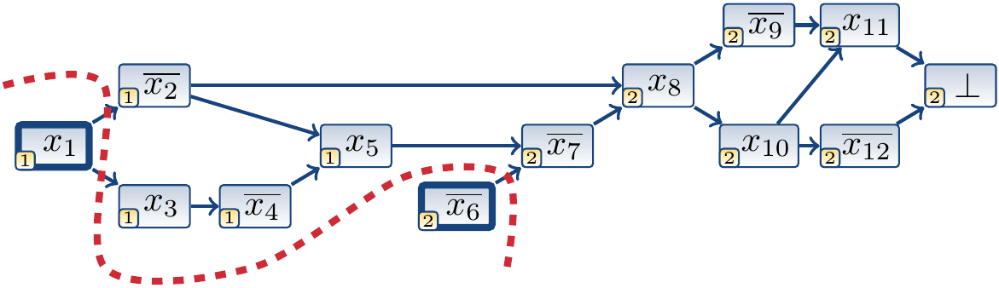

## Implication graphs

考虑CNF为:
$$
(¬x1∨¬x2)∧(¬x1∨x3)∧(¬x3∨¬x4)∧(x2∨x4∨x5)∧\\
(¬x5∨x6∨¬x7)∧(x2∨x7∨x8)∧(¬x8∨¬x9)∧(¬x8∨x10)∧\\
(x9∨¬x10∨x11)∧(¬x10∨¬x12)∧(¬x11∨x12).\\
$$
首先我们决定令$x_1$为真, 那么经过单位传播后得出迹为$x_1^{dec} ¬x_2^{(¬x1∨¬x2)} x_3^{(¬x1∨x3)} ¬x_4^{(¬x3∨¬x4)} x_5^{(x2∨x4∨x5)}.$ 

由此, 我们可以把变量之间的蕴含关系画成一张图：


> 其中$\overline{x_2}$ 表示$\neg x_2$ , 左下角的数字是决策层. 

要继续运算, 就必须再做出一次决策, 决定$x_6$的值. 我们决定$x_6$为假(此时开启了新的决策层), 那么迹就变成了:
$$
x_1^{dec} ¬x_2^{(¬x1∨¬x2)} x_3^{(¬x1∨x3)} ¬x_4^{(¬x3∨¬x4)} x_5^{(x2∨x4∨x5)}\\
¬x_6^{dec}¬x_7^{(¬x5∨x6∨¬x7)}x_8^{(x2∨x7∨x8)}¬x_9^{(¬x8∨¬x9)}x_{10}^{(¬x8∨x10)}x_{11}^{(x9∨¬x10∨x11)}¬x_{12}^{(¬x10∨¬x12)}
$$

> dec表示决策, 即assignment

对应的蕴含图如下：


们发现了矛盾, 用$\perp$表示. 该$\perp$节点的入边是由造成冲突的子句$(\neg x_{11}\lor x_{12})$产生的.

The implication graphs allow us to define possible reasons for a conflict. The idea is to pick a subset of the literals in the graph such that by **using unit clause propagation only**, the **same conflict can be obtained**. The **learned clause** is then simply the clause that **forbids this set of literals from appearing again** in the search.

***

## conflict cut & learned clause

* 对于图(V, E), **冲突切割(conflict cut)**就是点集V的一个分割W = ( A , B), 使得：


```
所有assignment的literal属于A; 
conflict vertex ⊥属于B.
```

* Let R={l∈A∣∃l′∈B:(l,l′)∈E} be the **reason set** of the conflict cut, 即该冲突切割的**原因集**(reason set), 它包含的是A中有连到B的边的节点的集合. 即**A中和B节点直接相连的节点**.


* 那么, 该冲突切割对应的**learned clause**就是 $\bigvee\limits_{l\in R}\neg l$ , 即**原因集R的取反**.


接下来, 我们对刚才的例子考察冲突切割：


* In the cut below, we have that A={x1,¬x6}, **R**={x1,¬x6}, and the **learned clause** is (¬x1∨x6).

  
  
  > **标红的点**即为上图中A和B直接相连的节点为x1,¬x6, 所以**原因集R**为x1,¬x6. learned clause为R的取反

* In the cut below, we have that A={x1,¬x2,x3,¬x4,x5,¬x6}, **R**={¬x2,x5,¬x6} and the **learned clause** (x2∨¬x5∨x6).
  

* In the cut below, we have that A={x1,…,¬x7,x8}, R={x8}, and the learned clause (¬x8).

  

* In the cut below, we have that A={x1,…,x5,¬x6,x10}, **R**={¬x2,x5,¬x6,x10} and the **learned clause** (x2∨¬x5∨x6∨¬x10).

  

实践中, 我们只关心具有某些特性的冲突切割. 我们希望学到的子句最好能引发新的单位传播过程. 

***

## unique implication point(UIP) & UIP cut 

* **唯一蕴含点(unique implication point, UIP)**：如果蕴含图中的某个点是**UIP**, 那么设**d**是**最近一次做决策的节点**(即包含决策层最深的决策文字的节点), **UIP是d到冲突节点的所有路径都必须经过的点**. 

  UIP cuts **always exist**: the latest decision vertex is a UIP by definition, 即最近一次的决策点必定是UIP.

* **唯一蕴含冲突切割(UIP cut)**是(A ,B), 其中**B**包含了**successors of UIP** from which there is a **path to ⊥**, **A**则包含了剩下的节点. 

  即UIP cut切割的B部分只能包含从**UIP**的**下一个节点**到冲突节点的vertex.

* **(first UIP cut)**: the UIP cut with **the largest possible A set**, first UIP cut, **最靠近冲突的UIP**, 使**集合A尽可能大**(这是为了减少回溯的层数, 充分利用前面的计算结果)


再次考察下面的蕴含图. 它的**最近决策点**是$\overline{x_6}$ , 因为它的决策层最深是2. 它有三个蕴含点：$\overline{x_6},\overline{x_7},x_8 $, 即从$\overline{x_6}$到冲突⊥的必经点.


* 下图所示的冲突切割不是唯一蕴含冲突切割, 因为集合B含有除唯一蕴含点$\overline{x_6}$的后继以外的节点 ($x_1$的后续节点).

  

* The cut below **is an UIP cut** but not the first UIP cut.

  

* The cut below **is an UIP cut** but not the first UIP cut.

  

* The cut below **is the first UIP cut**

  

  > 切割结果的B部分只包含 first UIP的下一个节点到冲突节点的全部节点.

假设我们从**UIP cut**中学到的**learned clause是C**, 那么C其实是CNF的一个逻辑上的结果, 不满足C就不满足CNF. 

经过学习之后, CDCL算法现在进行非时序性回溯：

1. 令m是**C**的**literal中第二深的决策层**(如果C中的文字全部都是一个决策层, 则m = 0); 

2. 从**迹**中**删除所有决策层大于m的literal**. 

   (即如果learned clause中只有一个literal, 则返回第0决策层)

**论断** C中**有且仅有一个文字literal**属于**最近的一个决策层**. 

因为是 UIP cut, 所以A中和B相连的最高决策层只有UIP这一个点, 即learned clause中属于最近的决策层只有一个literal

**推论** 若C中的文字全部都是一个决策层, 则C只有一个literal

***

## UIP cut & first UIP cut

*  Consider the UIP cut below.

  

  It produces the **learned clause** $(x2∨¬x5∨x6)$. 

  After learning the clause, the CDCL algorithm backjumps to the **level 1**, 即回到上一个决策层, 第一决策层, and then unit propagates $x6$ to true by **using the learned clause**.

  The new **trail** is: $x_1^{dec} ¬x_2^{(¬x1∨¬x2)} x_3^{(¬x1∨x3)} ¬x_4^{(¬x3∨¬x4)} x_5^{(x2∨x4∨x5)}x_6^{(x2∨¬x5∨x6)}$

* Consider the first UIP cut below.

  

  It produces the learned clause $(¬x8)$.

  After learning the clause, the CDCL algorithm backjumps to the **level 0** and then unit propagates x8 to false by using the learned clause.

  The new trail is: $¬x_8^{(¬x8)}$

first UIP cut 可以回溯更多, 减少决策消耗.

***

## 完整的CDCL演示

Consider the CNF formula
$$
(a∨b∨c)∧(a∨b∨¬c)∧\\
(¬b∨d)(a∨¬b∨¬d)∧(¬a∨e∨f)∧\\
(¬a∨e∨¬f)(¬e∨¬f)∧(¬a∨¬e∨f)
$$

1. 该CNF不含单位子句, 因此在决策层0我们不做任何事. 

2. 在决策层1, 我们做出一次决策：令a为假. 此时 BCP 不会propagate, trail is: $¬a^{决策}$.

3. 在决策层2, 我们再做一次决策：令b假. 对子句$(a\lor b\lor c)$进行单位传播, 得到c为真, 因此trail为$\neg a^{\text{决策}}\cdot\neg b^{\text{决策}}\cdot c^{(a\lor b\lor c)}$. 此时我们发现：子句$(a\lor b\lor\neg c)$为假, 我们得到了一个冲突.

   

   最近一次做决策的节点是$\overline b$, 它同时也是唯一蕴含点. $A=\{\overline a,\overline b\}$, $B=\{c,\perp\}$, 原因集$R=\{\overline a,\overline b\}$, 学习到的子句$C=(a\lor b)$. 其中$ \overline a$的决策层是1, $ \overline b$的决策层是2, 因此m = 1, 回到决策层1.

4. 在决策层1, 首先利用学到的子句$(a\lor b)$进行单位传播, 推出b为真, 然后根据$(\neg b\lor d)$推出d为真. 现在的trail是$\neg a^{\text{决策}}\cdot b^{(a\lor b)}\cdot d^{(\neg b\lor d)}$. 然而, 我们又发现了冲突：子句$(a\lor\neg b\lor\neg d)$不能满足. 

   

   最近一次做决策的节点是$\overline a$它同时也是唯一蕴含点. $A=\{\overline a\}$, $B=\{b,d,\perp\}$, 原因集$R=\{\overline a\}$, 学到的子句$C=(a)$, 仅含有一个文字, 故算法回溯到第0层. 

5. 在决策层0, 利用学到的子句$(a)$进行单位传播, 没有推测出其它变量的值. 现在的迹是$a^{(a)}$.

6. 在决策层1, 我们做出一次决策：令e为假. 进行单位传播：根据子句$(\neg a\lor e\lor f)$, 得知f为真. 现在的迹是$a^{(a)}\cdot\neg e^{\text{决策}}\cdot f^{(\neg a\lor e\lor f)}$. 此时我们发现子句$(\neg a\lor e\lor\neg f)$不能满足. 

   

   最近一次做决策的节点是$\overline e$, 它同时也是唯一蕴含点. $A=\{a,\overline e\}$, $B=\{f,\perp\}$, 原因集$R=\{a,\overline e\}$, 学到的子句$C=(\neg a\lor e)$, 其中a在第0层$\overline e$在第1层, $m=1$, 回溯到第0层. 

7. 在决策层0, 利用子句$(a)$进行对学到的子句$C=(\neg a\lor e)$单位传播, 得到$(e)$. 再进行单位传播, 根据子句$(\neg e\lor\neg f)$知道f为假, 此时迹为$a^{(a)}\cdot e^{(\neg a\lor e)}\cdot\neg f^{(\neg e\lor\neg f)}$. 而CNF中的最后一个子句是$(\neg a\lor\neg e\lor f)$, 得不到满足, 所以我们在**决策层0发现了矛盾**, 这意味着该**CNF**是**不可满足**的.

***

## satisfiable & unsatisfiable

* For ***satisfiable formulas***, the CDCL algorithm eventually finds a satisfying truth assignment because the learned clauses preserve them.

* For ***unsatisfiable formulas***, the algorithm eventually reports “unsatisfiable” because each conflict results in a new learned clause. There are only finitely many possible clauses and thus the algorithm will produce enough unary clauses at some point for a <u>**level 0 conflict** marking unsatisfiability.</u>

  **决策层0的conflict ==> unsatisfiability**


**reference:**

https://users.aalto.fi/~tjunttil/2020-DP-AUT/notes-sat/cdcl.html

https://blog.csdn.net/qaqwqaqwq/article/details/126020807