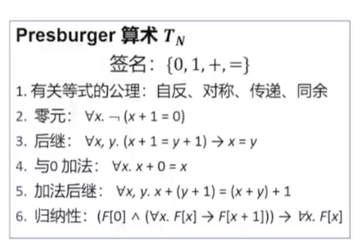
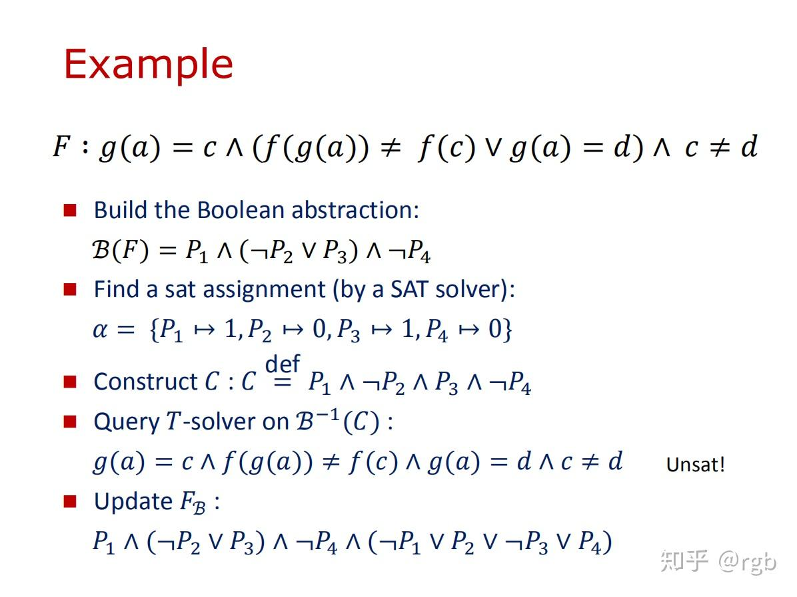
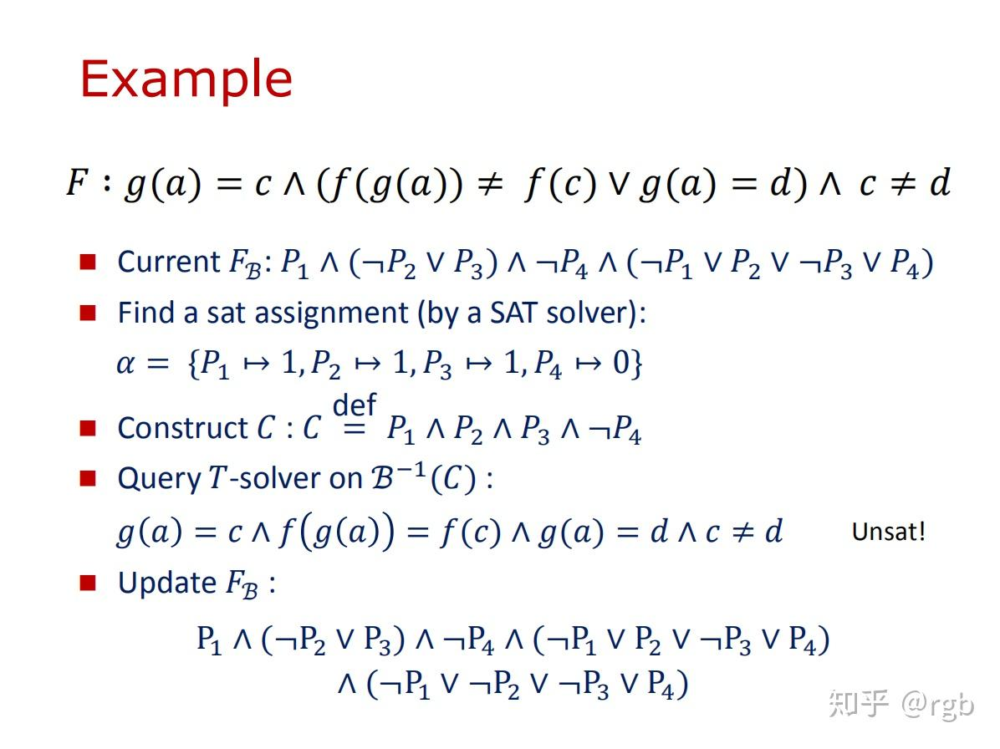
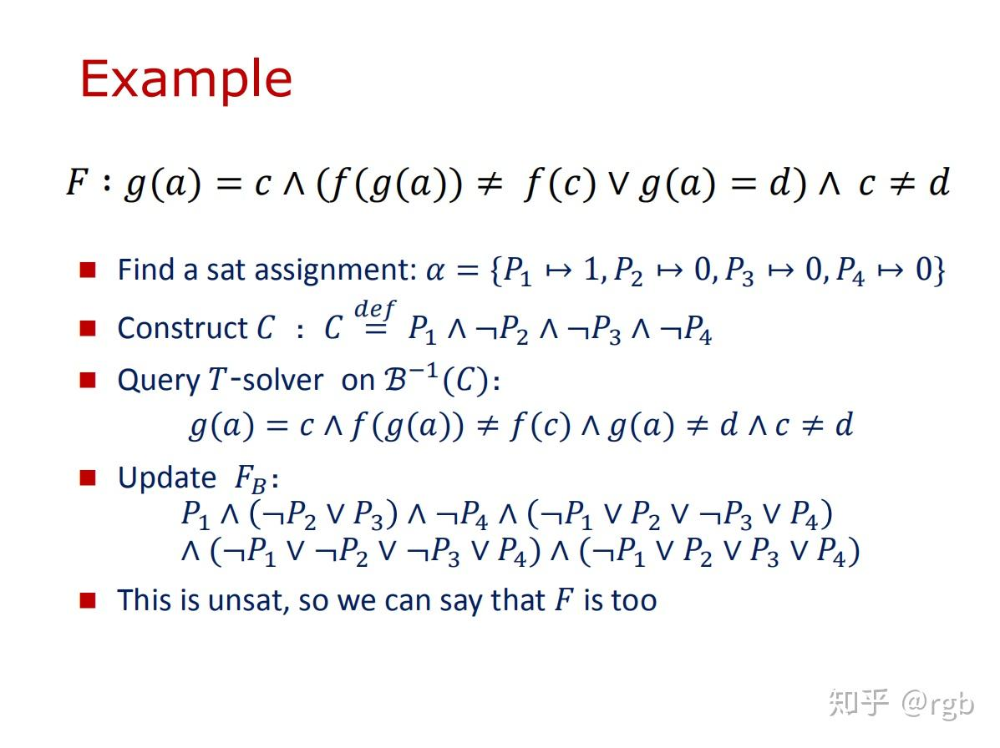

# Satisfiability Modulo Theories (SMT)

## 一阶理论

**命题逻辑propositional logic**的<u>表达能力有限</u>, 在比较复杂的情况下表达能力不足, **描述能力**远不如**谓词逻辑**（一阶逻辑）。那么，我们可以将可满足性问题**扩展**到一阶逻辑上。

一**阶逻辑first order logic**有较强的表达能力, 但<u>一阶逻辑是不可判定/半可判定的</u>. 然而，有时候我们不需要这么强的表达能力, 因为这样的**扩展过于宽泛**，以至于**难以提出有效的算法来对该问题进行求解**。于是，我们需要将可满足性问题研究的对象再适当**收缩**一下。例如，<u>将讨论的谓词逻辑公式**限制**在某一（或者**某些**）**理论Theories**下。</u>

所以有时候会**针对应用, 对非逻辑符号的使用进行限制**, 进而获得兼具表达能力和可判定性的逻辑理论, 此即为**一阶理论**.  

**<u>Theory即是对非逻辑符号的使用限制.</u>**

**一阶理论**是**一阶逻辑的受限形式**. 

* **signature**: 理论中允许出现的非逻辑符号集合. 包含**constant**, **variable**, **functions** and **predicates**.
* **axiom**: 规定这些非逻辑符号的含义.

e.g.

***

## SMT

SMT就是<u>在SAT的基础上</u>，**增加了一些一阶理论的内容**。

首先明确SMT和SAT的概念，SAT是指**命题逻辑公式**可满足性判定问题，而SMT是指另外一类公式的可满足性判定问题。这一类公式具有两个特点：

* 在命题逻辑公式里面混入了一些**一阶逻辑表达式**
* 具有任意的布尔结构

命题逻辑公式大家都知道，比如：
$$
P\land Q\land(R\rightarrow S\lor \neg T) \\
$$
也就是只允许出现变量、变量的否定和逻辑连接词。

而SMT的公式可以是这样：
$$
g(a)=c\land (f(g(a))\neq f(c)\lor g(a)=d)\land c\neq d \\
$$

这里面相对于命题逻辑公式，多了一些东西，也就是一开始所说的两个特点：

* 首先多了一些**非逻辑符号**，比如**函数** g(a), f(g(a)) ，比如**常量** c, d 。命题逻辑里只有 P, Q, R, $\lor$, $\rightarrow$ 这些逻辑符号，而非逻辑符号是一阶逻辑才有的内容；
* 其次，**布尔结构被拓展了**，这里可以理解为“变成了宏观的布尔结构”。比如 $g(a)=c$, $f(g(a))\neq f(c)$ 这种表达式，<u>替代了原来布尔表达式所规定的“原子(atom)”的定义</u>。

对于上面的第二点“拓展的布尔结构”，可以用这个例子加以理解。同样是借用上面的公式，
$$
F: g(a)=c\land (f(g(a))\neq f(c)\lor g(a)=d)\land c\neq d \\
$$
做一次换元：
$$
g(a)=c \mapsto P_1 \\ f(g(a))= f(c)\mapsto P_2 \\ g(a)=d\mapsto P_3 \\ c= d\mapsto P_4 \\
$$
于是就变成了下面的公式：
$$
B(F): P_1\land (\neg P_2 \lor P_3)\land \neg P_4 \\
$$
这就变成了最普通的布尔表达式。所以可以说SMT的公式具有**任意的抽象布尔结构**，<u>不关心atom的语义由什么构成</u>（在<u>命题逻辑</u>中由<u>变量</u>构成，在<u>一阶逻辑</u>中由<u>变量函数谓词</u>构成），只关心逻辑连接词是什么，这样得到的B(F)就是对F的抽象，也可以理解为宏观的布尔结构。

因为SMT是由SAT+一阶理论构成，所以**SMT**的求解办法就是**综合了**<u>SAT solver</u>和<u>Theory solver</u>（默认它们俩都有自动求解工具），二者互相配合，共同求解。上面那个公式的求解过程如下图所示:

reference

https://www.bilibili.com/video/BV1Ss4y1F79a/?spm_id_from=333.337.search-card.all.click&vd_source=1e015cfc20e9755d9ee75ac3716a4d42

https://www.zhihu.com/question/29586582